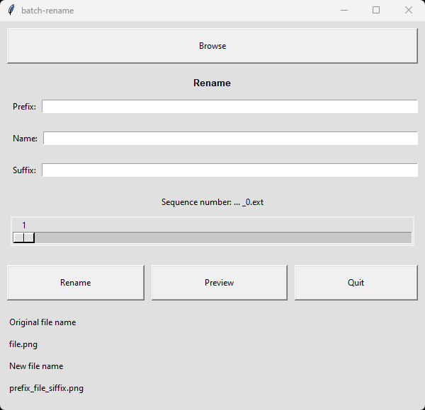

# Batch Rename Tool

  

## Description

This is a simple batch rename tool built with Tkinter in Python. The program allows you to select multiple files and rename them in bulk with options for adding prefixes, names, suffixes, and sequential numbering.

## Features

- Select multiple files for batch renaming.
- Customize filenames by adding prefixes, names, and suffixes.
- Include a sequence number with adjustable numeric scale.
- Preview the new filenames before executing the renaming process.

## Usage

1. Run the program using `python batch_rename.py` or any preferred method.
2. Click the "Browse" button to select files for renaming.
3. Customize the renaming options (Prefix, Name, Suffix, Numeric Scale).
4. Click "Preview" to see the proposed new filenames.
5. Click "Rename" to execute the batch renaming process.
6. Use "Quit" to exit the application.

## Requirements

- Python 3.x
- Tkinter

## Notes

- Ensure necessary permissions to rename files in the selected directory.
- Resolving file conflicts may be required when renaming.

## How to Run

1. Install Python (if not already installed).
2. Clone the repository: `git clone https://github.com/your-username/batch-rename-tool.git`
3. Navigate to the project directory: `cd batch-rename-tool`
4. Run the program: `python batch_rename.py`

Feel free to contribute, report issues, or suggest improvements!
